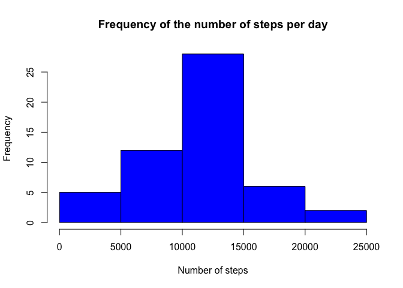
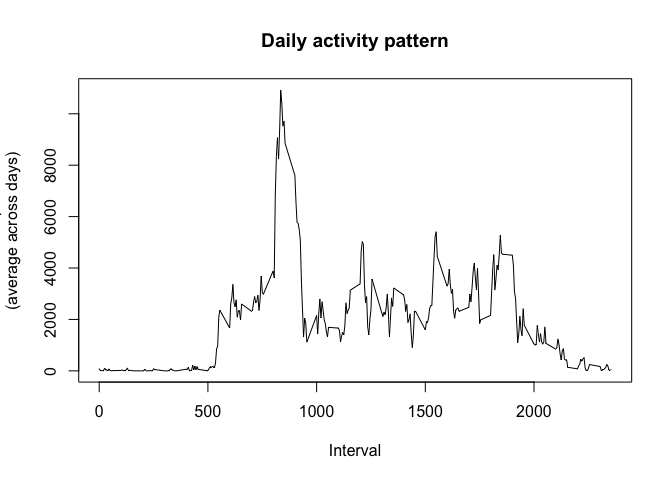
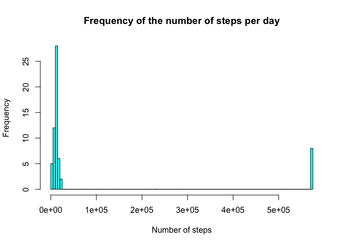
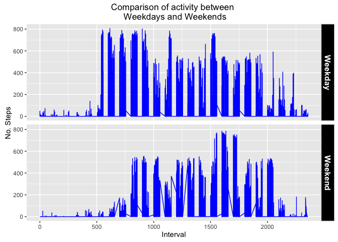

# Reproducible Research: Peer Assessment 1


## Loading and preprocessing the data

```r
data_activity=read.csv("activity.csv")
data_activity$date= as.POSIXct(strptime(data_activity$date, format="%Y-%m-%d"))
data_NA=data_activity
data_activity=na.omit(data_activity)
```

## What is mean total number of steps taken per day?

```r
library(dplyr)
```

```
## 
## Attaching package: 'dplyr'
```

```
## The following objects are masked from 'package:stats':
## 
##     filter, lag
```

```
## The following objects are masked from 'package:base':
## 
##     intersect, setdiff, setequal, union
```

```r
library(ggplot2)
```

```
## Warning: package 'ggplot2' was built under R version 3.2.4
```

```r
data_mean=data_activity%>%group_by(date)%>%summarize(total_steps=sum(steps))
hist(data_mean$total_steps, col="blue", main="Frequency of the number of steps per day", xlab="Number of steps")
```

<!-- -->

```r
me_med_data=na.omit(data_mean)%>%summarise(mean(total_steps), median(total_steps))

cat ("The mean is: ",me_med_data$`mean(total_steps)`[1], "steps per day and the median is: ", me_med_data$`median(total_steps)`[1], "steps per day")
```

```
## The mean is:  10766.19 steps per day and the median is:  10765 steps per day
```

## What is the average daily activity pattern?

```r
day_steps=data_activity%>%group_by(interval)%>%summarize(total_steps=sum(steps))
plot(day_steps$interval, day_steps$total_steps, type="l", main="Daily activity pattern", ylab="No. steps \n(average across days)", xlab="Interval")
```

<!-- -->

```r
cat("The maximum number of steps in average is found in the", day_steps[day_steps$total_steps==max(day_steps$total_steps, na.rm=T),]$interval,"interval")
```

```
## The maximum number of steps in average is found in the 835 interval
```

```r
## Imputing missing values
```

```r
Na_n=nrow(data_NA%>%filter(is.na(steps)))
cat("The data contains",Na_n, "NAs")
```

```
## The data contains 2304 NAs
```

```r
#- Replacing all NAs with the average number of steps in the interval
data_NA2=data_NA%>%mutate(steps=replace(steps,is.na(steps),day_steps[day_steps$interval==data_NA$interval]$total_steps))

data_mean_NA2=data_NA2%>%group_by(date)%>%summarize(total_steps=sum(steps))
hist(data_mean_NA2$total_steps, col="cyan1", main="Frequency of the number of steps per day", xlab="Number of steps", breaks=150)
```

<!-- -->

```r
me_med_data2=data_mean_NA2%>%summarise(mean(total_steps), median(total_steps))

cat ("The mean replacing the NA with the interval average is: ",me_med_data2$`mean(total_steps)`[1], "steps per day and the median is: ", me_med_data2$`median(total_steps)`[1], "steps per day")
```

```
## The mean replacing the NA with the interval average is:  84188.07 steps per day and the median is:  11458 steps per day
```

```r
cat("Replacing NAs, change the mean by",me_med_data2$`mean(total_steps)`[1]- me_med_data$`mean(total_steps)`[1], "steps. The median by:", me_med_data2$`median(total_steps)`[1]-me_med_data$`median(total_steps)`[1])
```

```
## Replacing NAs, change the mean by 73421.88 steps. The median by: 693
```
## Are there differences in activity patterns between weekdays and weekends?

```r
data_activity$day=weekdays(data_activity$date)
data_NA2=data_activity%>%mutate(day=replace(day,day=="Sunday"|day=="Saturday", "weekend"))%>%mutate(day=replace(day,day!="weekend", "weekday"))

labels <- c(weekend = "Weekend", weekday = "Weekday")
ggplot(data_NA2, aes(interval, steps))+ 
    geom_line(colour="blue") +
    facet_grid(day ~ . , labeller=labeller(day=labels))+
    xlab("Interval") + 
    ylab("No. Steps")+
    ggtitle("Comparison of activity between \n Weekdays and Weekends")+
    theme(strip.text.y = element_text(size=12, face="bold", colour="white"),
          strip.background = element_rect(colour="gray", fill="black"))
```

<!-- -->

